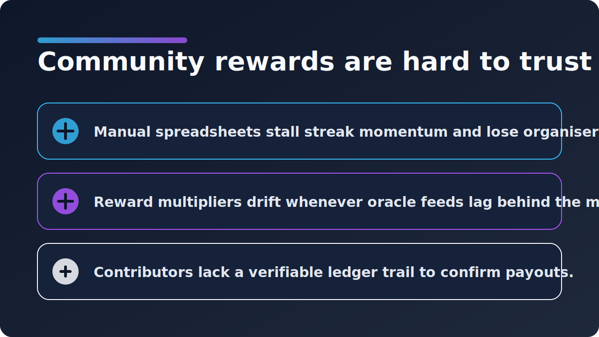
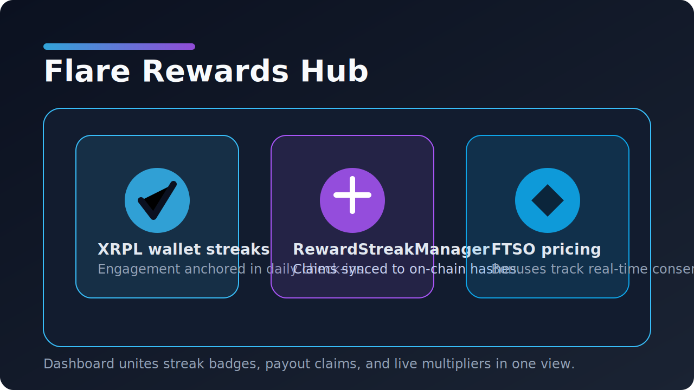
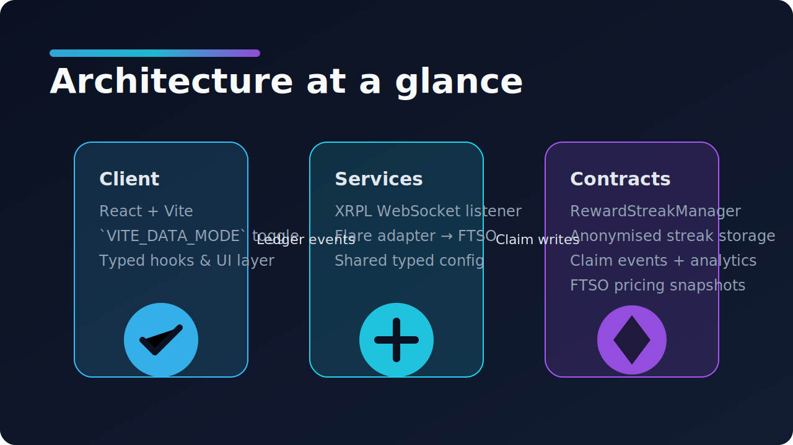
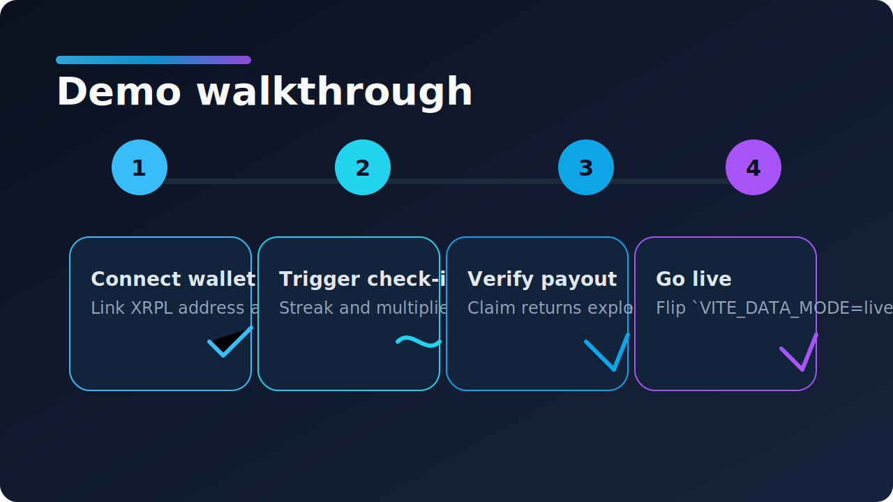
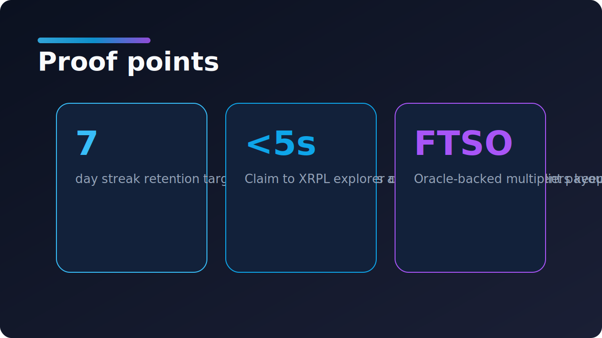
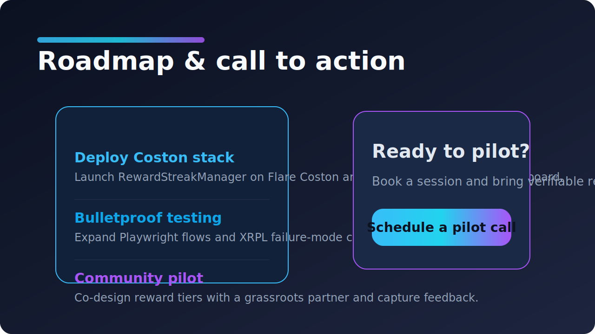

# Flare Rewards Hub - Slide Deck

## Slide 1 - Community rewards are hard to trust

- Manual payout spreadsheets stall streak momentum and lose context between organisers.
- Bonus values drift whenever reward multipliers follow stale oracle feeds.
- Contributors cannot audit what was paid without a verifiable ledger footprint.

---

## Slide 2 - Flare Rewards Hub

- XRPL wallet streaks anchor consistent engagement; FTSO pricing keeps bonuses market-aligned.
- The RewardStreakManager smart contract records check-ins and links every claim to a ledger hash.
- React dashboard gives communities streak badges, live multipliers, and a frictionless claim CTA.

---

## Slide 3 - Architecture at a glance

- Client: Vite-powered React app with a `VITE_DATA_MODE` toggle for mock demos or live adapters.
- Services: XRPL listener streams on-ledger actions while Flare adapter ingests FTSO price feeds.
- Contracts: RewardStreakManager on Flare Coston stores anonymised streak data and claim events.

---

## Slide 4 - Demo walkthrough

1. Connect an XRPL wallet and enrol in the daily community challenge.
2. Trigger a check-in; the streak ticker increments and the multiplier animates.
3. Submit a claim and land on the XRPL explorer to verify the payout hash.
4. Switch to live mode by flipping `VITE_DATA_MODE=live` once the adapters are deployed.

---

## Slide 5 - Proof points

- 7-day streak retention target backed by automated reminders.
- Sub-5-second path from claim submission to XRPL explorer confirmation.
- Oracle-backed multipliers so rewards stay aligned with FTSO consensus pricing.

---

## Slide 6 - Roadmap & call to action

- Deploy RewardStreakManager to Flare Coston and wire live adapters from the dashboard.
- Expand Playwright coverage and XRPL failure-mode tests to safeguard streak resets.
- Launch a pilot with a grassroots community and co-design advanced reward tiers.
- Book a pilot session to bring verifiable, streak-based rewards to your members.
